# emp3r0r
linux post-exploitation framework made by linux user

**Still under active development**

- [中文介绍](https://www.freebuf.com/sectool/259079.html)
- [check my blog for updates](https://jm33.me/emp3r0r-0x00.html)
- [how to use](https://github.com/jm33-m0/emp3r0r/wiki)

____

## table of contents

<!-- vim-markdown-toc GFM -->

* [what to expect (in future releases)](#what-to-expect-in-future-releases)
* [why another post-exploitation tool?](#why-another-post-exploitation-tool)
* [what does it do](#what-does-it-do)
    * [glance](#glance)
    * [core features](#core-features)
        * [transports](#transports)
        * [auto proxy for agents without direct internet access](#auto-proxy-for-agents-without-direct-internet-access)
        * [anti-antivirus (or anti-whateveryoucallthem)](#anti-antivirus-or-anti-whateveryoucallthem)
        * [agent traffic](#agent-traffic)
        * [packer - start agent in memory](#packer---start-agent-in-memory)
        * [dropper - pure memory based agent launching](#dropper---pure-memory-based-agent-launching)
        * [hide processes and files](#hide-processes-and-files)
        * [persistence](#persistence)
    * [modules](#modules)
        * [shellcode loader](#shellcode-loader)
        * [basic command shell](#basic-command-shell)
        * [fully interactive and stealth bash shell](#fully-interactive-and-stealth-bash-shell)
        * [credential harvesting](#credential-harvesting)
        * [auto root](#auto-root)
        * [LPE suggest](#lpe-suggest)
        * [port mapping](#port-mapping)
        * [reverse port mapping (interoperability with other frameworks)](#reverse-port-mapping-interoperability-with-other-frameworks)
        * [plugin system](#plugin-system)
* [thanks](#thanks)

<!-- vim-markdown-toc -->
____

## what to expect (in future releases)

- [x] packer: cryptor + `memfd_create`
- [x] packer: use `shm_open` in older Linux kernels
- [x] dropper: shellcode injector - python
- [x] port mapping: forward from CC to agents, so you can use encapsulate other tools (such as Cobalt Strike) in emp3r0r's CC tunnel
- [x] randomize everything that can be randomized (file path, port number, etc)
- [x] injector: shellcode loader, using python2
- [ ] injector: shellcode loader, using go
- [ ] injector: inject shellcode into another process, using gdb
- [ ] dropper: shellcode injector - dd
- [ ] dropper: downloader (stage 0) shellcode
- [ ] network scanner
- [ ] passive scanner, for host/service discovery
- [ ] exploit kit
- [ ] conservative weak credentials scanner
- [ ] auto pwn using weak credentials and RCEs

## why another post-exploitation tool?

why not? i dont see many post-exploitation frameworks for linux systems, even if there were, they are nothing like mine

as a linux user, the most critical thing for remote administration is **terminal**. if you hate the garbage reverse shell experience (sometimes it aint even a shell), take a look at emp3r0r, you will be impressed

yes i just want to make a post-exploitation tool for linux users like me, who want better experience in their hacking

another reason is compatibility. as emp3r0r is mostly written in [Go](https://golang.org), and fully static (so are all the plugins used by emp3r0r), it will run everywhere (tested on Linux 2.6 and above) you want, regardless of the shitty environments. in some cases you wont even find bash on your target, dont worry, emp3r0r uploads its own [bash](https://github.com/jm33-m0/static-bins/tree/main/vaccine) and many other useful tools

why is it called `emp3r0r`? because theres an [empire](https://github.com/BC-SECURITY/empire)

i hope this tool helps you, and i will add features to it as i learn new things

## what does it do

### glance

* beautiful terminal UI
* **perfect reverse shell** (true color, key bindings, custom bashrc, custom bash binary, etc)
* auto **persistence** via various methods
* **post-exploitation tools** like nmap, socat, are integreted with reverse shell
* **credential harvesting**
* process **injection**
* ELF **patcher**
* **hide processes and files** via libc hijacking
* port mapping, socks5 **proxy**
* auto root
* **LPE** suggest
* system info collecting
* file management
* log cleaner
* **stealth** connection
* anti-antivirus
* internet access checker
* **autoproxy** for semi-isolated networks
* all of these in one **HTTP2** connection
* can be encapsulated in any external proxies such as **TOR**, and **CDNs**
* interoperability with **metasploit / Cobalt Strike**
* and many more...

### core features

#### transports

emp3r0r utilizes [HTTP2](https://github.com/posener/h2conn) (TLS enabled) for its CC communication, but you can also encapsulate it in other transports such as [TOR](https://github.com/jm33-m0/emp3r0r/wiki/Getting-started#tor), and [CDNs](https://github.com/jm33-m0/emp3r0r/wiki/Getting-started#cdn). all you need to do is [tell emp3r0r agent to use your proxy](https://github.com/jm33-m0/emp3r0r/wiki/Getting-started#tor-1)

also, emp3r0r has its own CA pool, agents trusts only emp3r0r's own CA (which you can [generate](https://github.com/jm33-m0/emp3r0r/wiki/Getting-started#build-cc) using `build.py`), making MITM attack much harder

below is a screenshot of emp3r0r's CC server, which has 3 agent coming from 3 different transports

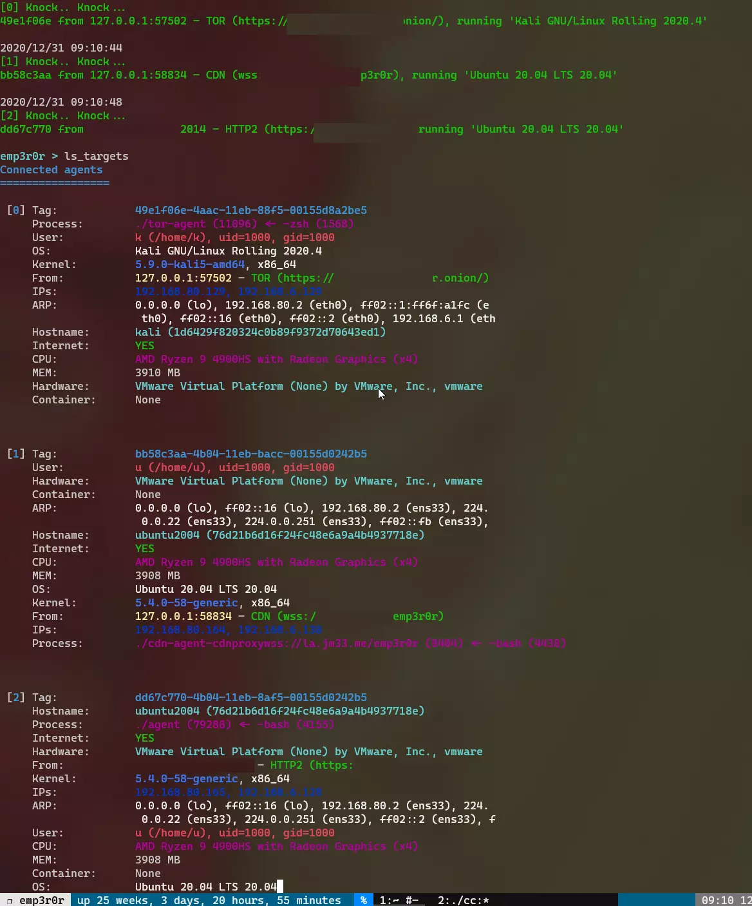

#### auto proxy for agents without direct internet access

emp3r0r agents check if they have internet access on start, and start a socks5 proxy if they do, then they broadcast their proxy addresses (in encrypted form) on each network they can reach

if an agent doesn't have internet, its going to listen for such broadcasts. when it receives a working proxy, it starts a port mapping of that proxy and broadcasts it to its own networks, bringing the proxy to every agent it can ever touch, and eventually bring all agents to our CC server.

in the following example, we have 3 agents, among which only one (`[1]`) has internet access, and `[0]` has to use the proxy passed by `[2]`

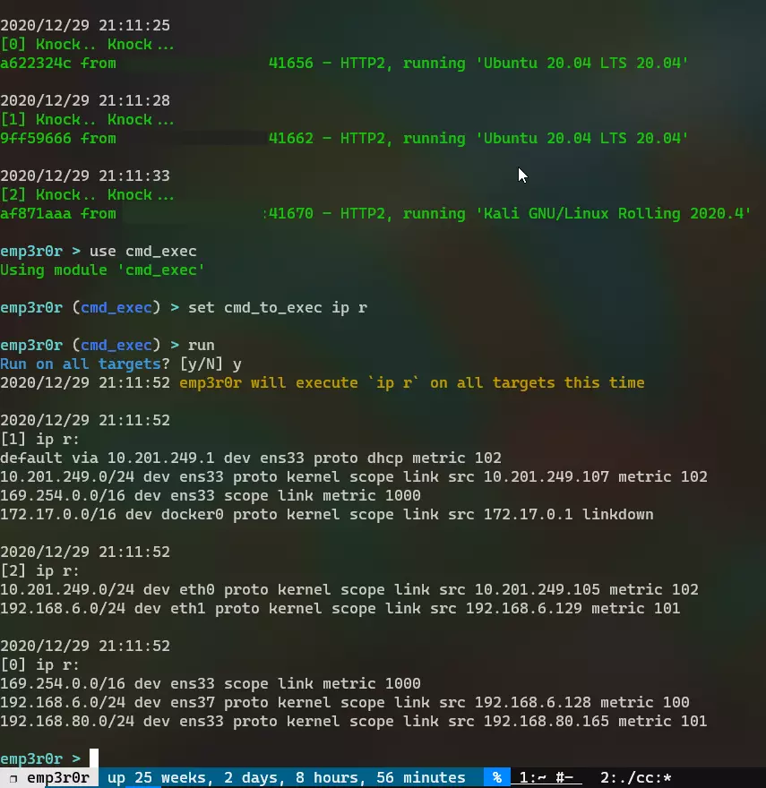

#### anti-antivirus (or anti-whateveryoucallthem)

- a cryptor that loads agent into memory
- shellcode dropper
- everything is randomized
- one agent build for each target

#### agent traffic

every time an agent starts, it checks a preset URL for CC status, if it knows CC is offline, no further action will be executed, it waits for CC to go online

you can set the URL to a GitHub page or other less suspicious sites, your agents will poll that URL every random minutes

no CC communication will happen when the agent thinks CC is offline

if it isnt:

bare HTTP2 traffic:

when using Cloudflare CDN as CC frontend:

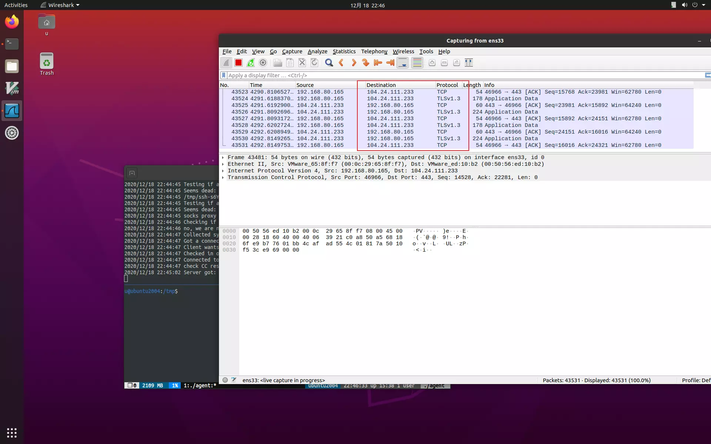

#### packer - start agent in memory

[packer](https://github.com/jm33-m0/emp3r0r/wiki/Packer) encrypts `agent` binary, and runs it from memory (using `memfd_create`)

currently emp3r0r is mostly memory-based, if used with this packer

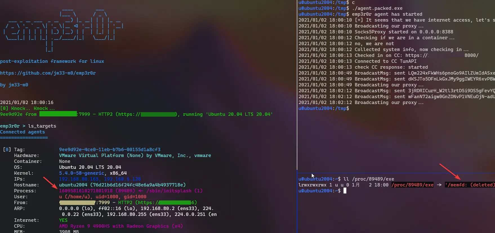

#### dropper - pure memory based agent launching

[dropper](https://github.com/jm33-m0/emp3r0r/wiki/Dropper) drops a shellcode or script on your target, eventually runs your agent, in a stealth way

below is a screenshot of a python based shellcode delivery to agent execution:

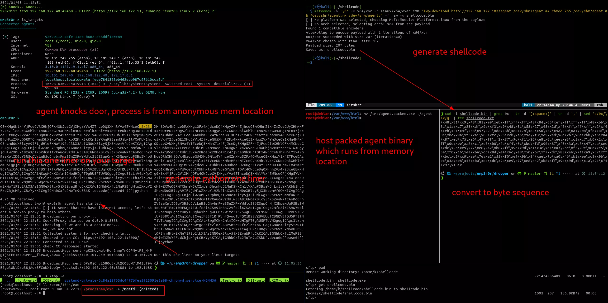

#### hide processes and files

currently emp3r0r uses [libemp3r0r](https://github.com/jm33-m0/emp3r0r/tree/master/libemp3r0r) to hide its files and processes, which utilizes glibc hijacking

#### persistence

currently implemented methods:

- [libemp3r0r](https://github.com/jm33-m0/emp3r0r/tree/master/libemp3r0r)
- cron
- bash profile and command injection

more will be added in the future

### modules

#### shellcode loader

this module helps you execute meterpreter or Cobalt Strike shellcode directly in emp3r0r's memory,
combined with [reverse_portfwd](#reverse-port-mapping-interoperability-with-other-frameworks),
you can use other post-exploitation frameworks right inside emp3r0r

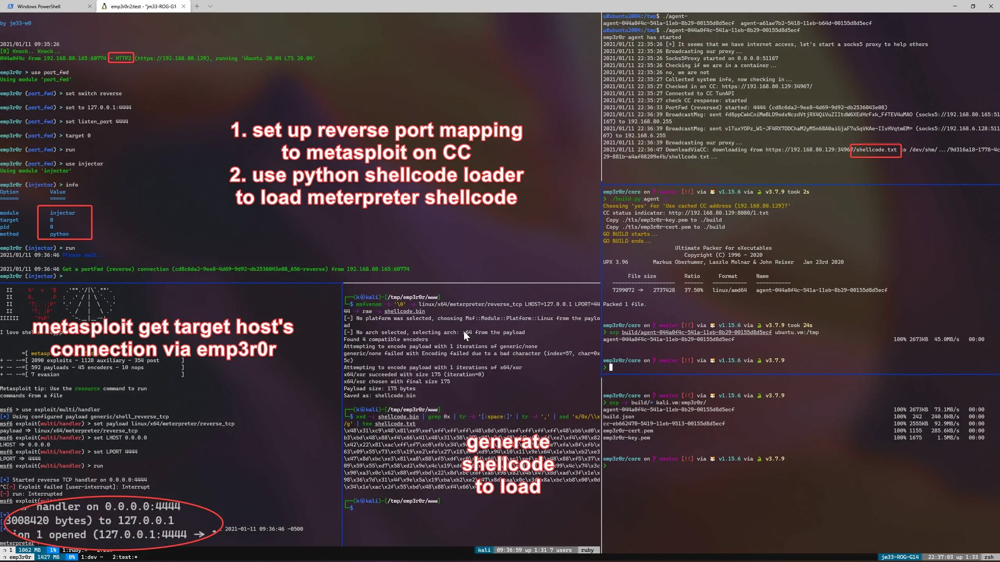

#### basic command shell

this is **not a shell**, it just executes any commands you send with `sh -c` and sends the result back to you

besides, it provides several useful helpers:

- file management: `put` and `get`
- command autocompletion
- `#net` shows basic network info, such as `ip a`, `ip r`, `ip neigh`
- `#kill` processes, and a simple `#ps`
- `bash` !!! this is the real bash shell, keep on reading!

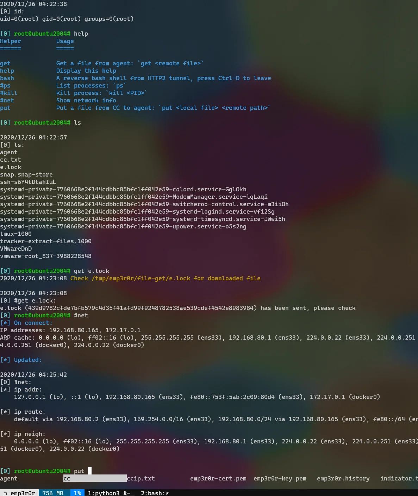

#### fully interactive and stealth bash shell

a reverse bash shell, started with custom `bash` binary and `bashrc`, leaving no trace on the system shell

emp3r0r's terminal supports **everything your current terminal supports**, you can use it just like an [openssh](https://www.openssh.com/) session

but wait, it's more than just a reverse bash shell, with [module vaccine](https://github.com/jm33-m0/static-bins/tree/main/vaccine), you can use whatever tool you like on your target system

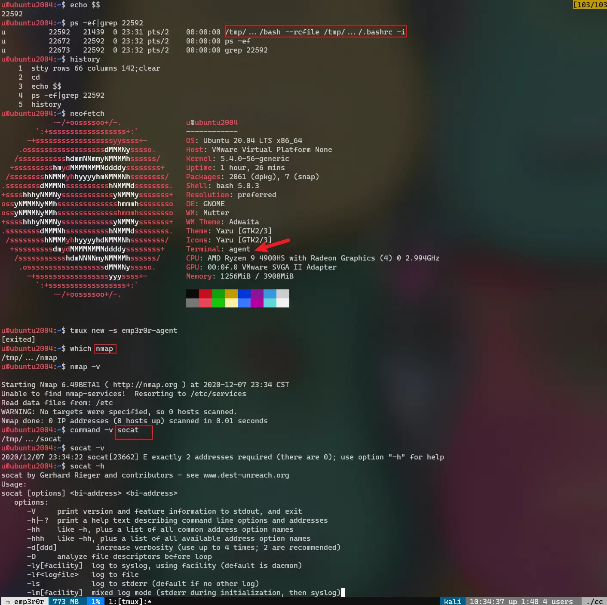

#### credential harvesting

not implemented yet

i wrote about this in my [blog](https://jm33.me/sshd-injection-and-password-harvesting.html)

#### auto root

currently emp3r0r supports [CVE-2018-14665](https://jm33.me/sshd-injection-and-password-harvesting.html), agents can exploit this vulnerability if possible, and restart itself with root privilege

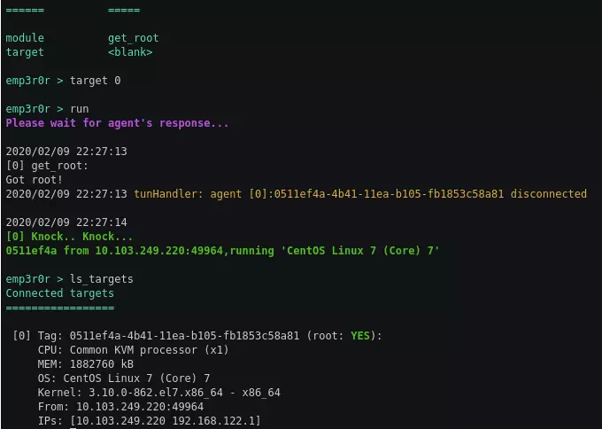

#### LPE suggest

upload the latest:

- [mzet-/linux-exploit-suggester](https://github.com/mzet-/linux-exploit-suggester)
- [pentestmonkey/unix-privesc-check](https://github.com/pentestmonkey/unix-privesc-check)

and run them on target system, return the results

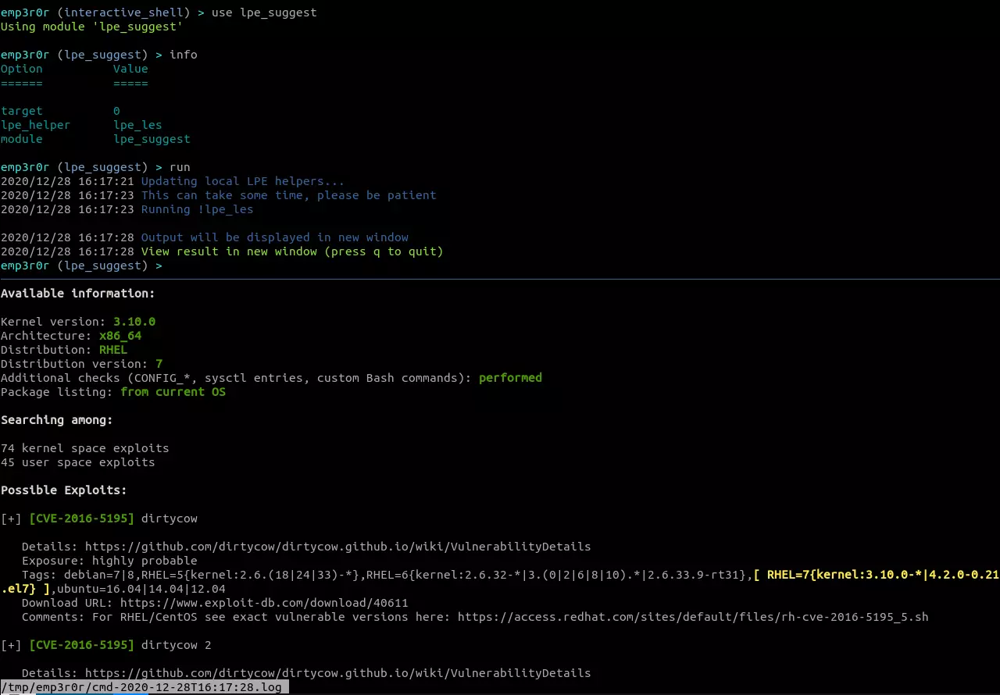

#### port mapping

map any target addresses to CC side, using HTTP2 (or whatever transport your agent uses)

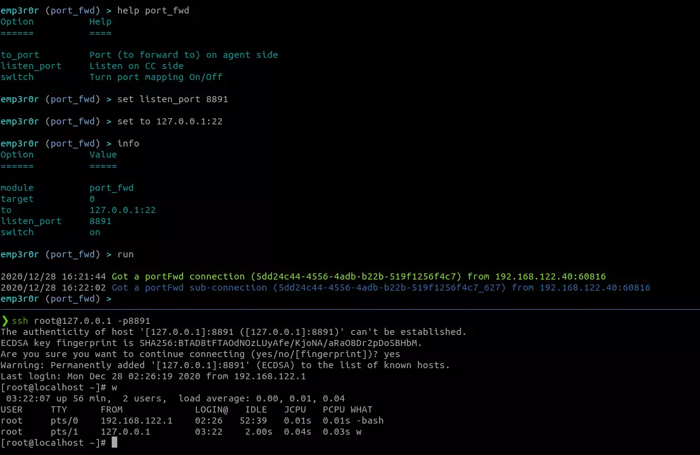

#### reverse port mapping (interoperability with other frameworks)

this screenshot shows a [meterpreter](https://www.offensive-security.com/metasploit-unleashed/meterpreter-basics/) session established with the help of `emp3r0r`

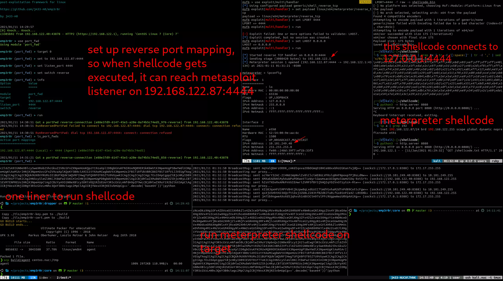

#### plugin system

yes, there is a plugin system. please read the [wiki](https://github.com/jm33-m0/emp3r0r/wiki/Plugins) for more information

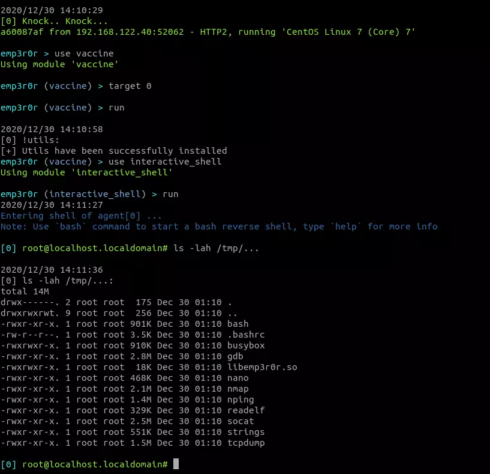

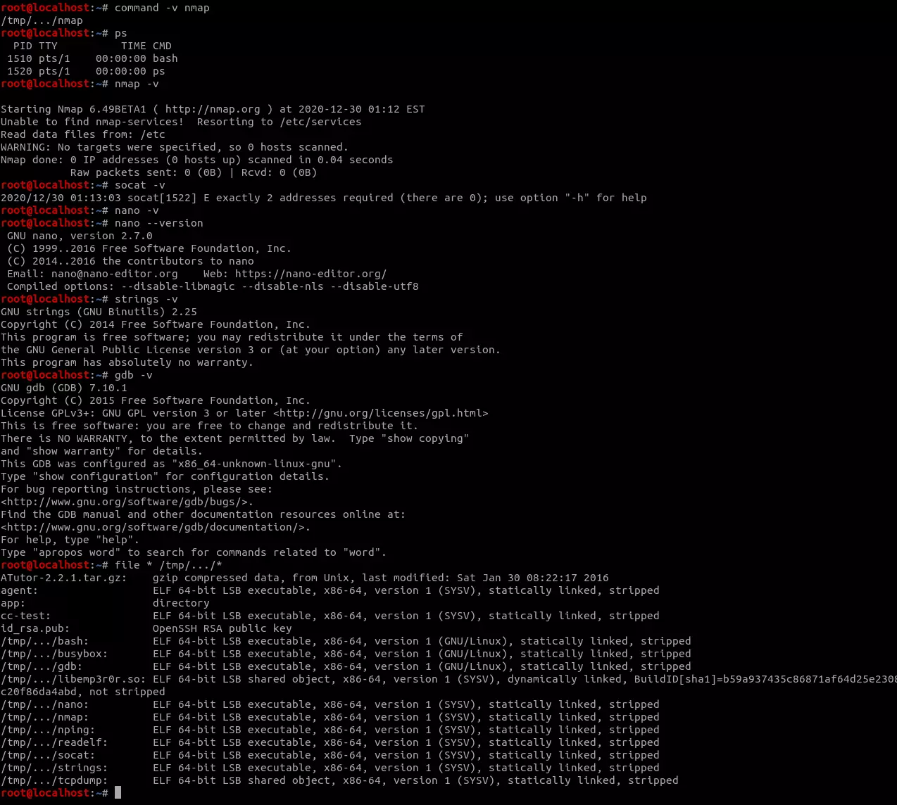

## thanks

- [pty](https://github.com/creack/pty)
- [guitmz](https://github.com/guitmz)
- [sektor7](https://blog.sektor7.net/#!res/2018/pure-in-memory-linux.md)
- [readline](https://github.com/bettercap/readline)
- [h2conn](https://github.com/posener/h2conn)
- [diamorphine](https://github.com/m0nad/Diamorphine)
- [Upgrading Simple Shells to Fully Interactive TTYs](https://blog.ropnop.com/upgrading-simple-shells-to-fully-interactive-ttys/)
